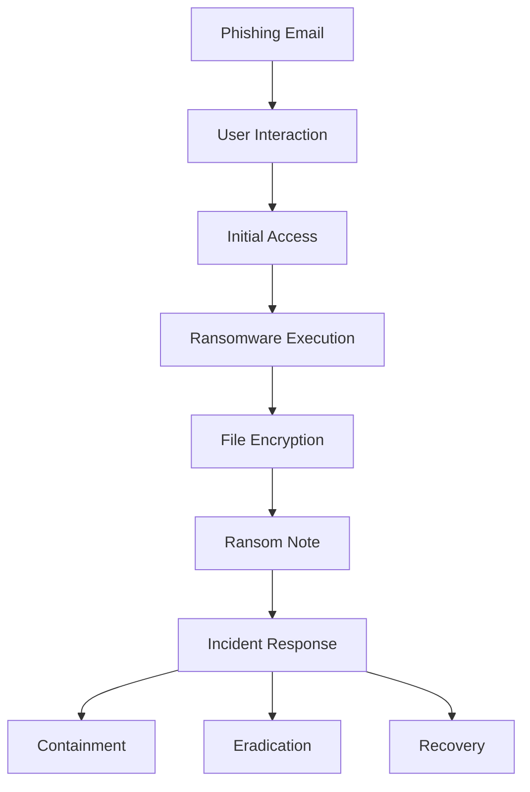

# Ransomware Incident Analysis

## Project Overview

This project documents and analyzes a ransomware attack against a healthcare organization. The incident is examined using the 5 W's framework, mapped to the MITRE ATT&CK framework, and evaluated using NIST incident response principles.

## Skills Demonstrated

- Incident Response
- Ransomware Analysis
- MITRE ATT&CK Framework
- NIST Incident Response Framework
- Threat Analysis
- Security Documentation

## Attack Flow Diagram

## Incident Details

**Date:** June 21, 2025

### Description

An organized group of threat actors launched a ransomware attack against a healthcare company. The attackers gained unauthorized access through a phishing campaign and deployed ransomware that encrypted critical files across the organization.

## The 5 W's

### Who

An organized group of cybercriminals conducted the attack.

### What

A ransomware attack that encrypted critical organizational data.

### Where

A healthcare organization.

### When

Tuesday at 9:00 a.m.

### Why

The attackers successfully compromised company systems through a phishing attack and deployed ransomware. Their apparent motivation was financial gain, as they demanded payment in exchange for a decryption key.

## Impact Assessment

The ransomware attack significantly impacted the healthcare organization's operations. Critical files were encrypted, preventing employees from accessing patient records, scheduling systems, and other essential business applications.

### Business Impact

- Disruption of healthcare services.
- Reduced employee productivity.
- Financial losses caused by operational downtime.
- Increased costs associated with incident response and recovery.

### Security Impact

- Loss of availability of critical data.
- Potential compromise of sensitive information.
- Increased risk of regulatory and compliance violations.

### Severity

High

## Indicators of Compromise (IOCs)

The following indicators may be associated with the ransomware incident:

- Suspicious phishing email received by employees
- Unexpected email attachments or malicious links
- Unauthorized user account activity
- Sudden encryption of files
- Appearance of ransom notes on affected systems
- Unusual PowerShell or command-line activity
- Increased CPU and disk usage during encryption
- Inability to access critical files and applications

## MITRE ATT&CK Mapping

| Attack Stage | MITRE ATT&CK Technique | Technique ID |
|-------------|------------------------|--------------|
| Initial Access | Phishing | T1566 |
| Execution | User Execution | T1204 |
| Credential Access | Credential Harvesting | T1056 |
| Persistence | Registry Run Keys/Startup Folder | T1547 |
| Command and Control | Application Layer Protocol | T1071 |
| Impact | Data Encrypted for Impact | T1486 |

### Analysis

The attackers gained initial access through a phishing email. After a user interacted with the malicious content, the ransomware executed on the system and encrypted critical files, causing a loss of availability and business disruption.

## Incident Response Actions

### Identification

- Detected ransomware activity on multiple endpoints.
- Confirmed unauthorized encryption of critical files.

### Containment

- Isolated infected systems from the network.
- Disabled compromised user accounts.
- Blocked malicious domains and IP addresses.

### Eradication

- Removed ransomware binaries and malicious files.
- Conducted malware scans across affected systems.
- Reset passwords for affected accounts.

### Recovery

- Restored critical data from secure backups.
- Verified system functionality before reconnecting systems to the network.
- Monitored systems for signs of reinfection.

### Lessons Learned

- Conducted a post-incident review.
- Updated security controls and response procedures.
- Improved employee security awareness training.

## Recommendations

To reduce the likelihood of future ransomware attacks, the healthcare organization should implement the following security controls:

### Security Awareness Training

- Conduct regular phishing awareness training for employees.
- Perform simulated phishing exercises to identify training needs.

### Multi-Factor Authentication (MFA)

- Require MFA for all user accounts, especially privileged accounts.
- Reduce the risk of unauthorized access from compromised credentials.

### Email Security

- Deploy advanced email filtering solutions.
- Block malicious attachments and suspicious links.

### Endpoint Protection

- Implement Endpoint Detection and Response (EDR) solutions.
- Continuously monitor endpoints for malicious activity.

### Backup Strategy

- Maintain regular offline backups of critical systems and data.
- Periodically test backup restoration procedures.

### Vulnerability Management

- Regularly patch operating systems and applications.
- Conduct vulnerability assessments to identify security weaknesses.

### Network Segmentation

- Separate critical healthcare systems from the general corporate network.
- Limit lateral movement by attackers.

## Key Takeaways

This incident demonstrates how a successful phishing attack can lead to significant operational and security consequences.

Key takeaways from the analysis include:

- Employee awareness training is critical for preventing phishing attacks.
- Multi-factor authentication can help reduce unauthorized access.
- Regular backups are essential for ransomware recovery.
- Continuous monitoring improves threat detection capabilities.
- A structured incident response process reduces recovery time.
- Proactive security controls are more effective than reactive measures.

## Conclusion

This project analyzed a ransomware attack against a healthcare organization using industry-standard cybersecurity frameworks. The investigation applied the 5 W's methodology, MITRE ATT&CK techniques, and NIST incident response principles to understand the attack lifecycle, assess organizational impact, and recommend security improvements.

The analysis highlights the importance of proactive cybersecurity measures, employee awareness training, and effective incident response planning in defending against ransomware threats.
